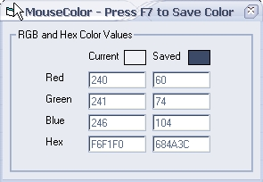



## MouseColor

### Description

Have you ever tried to figure out what particular color that is on a website or in a program? Well this program makes it very easy! All you have to do is run it, point your mouse to the color you want to copy, and hit F7. Voilá! The exact RGB and Hex values of the color are displayed and copied to the clipboard for your convenience!
 
### More Info
 

             |
---                |---
**Submitted On**   |2002-06-22 14:31:22
**By**             |[Steven Koeppel](https://github.com/Planet-Source-Code/PSCIndex/blob/master/ByAuthor/steven-koeppel.md)
**Level**          |Beginner
**User Rating**    |4.7 (14 globes from 3 users)
**Compatibility**  |VB 6\.0
**Category**       |[Graphics](https://github.com/Planet-Source-Code/PSCIndex/blob/master/ByCategory/graphics__1-46.md)
**World**          |[Visual Basic](https://github.com/Planet-Source-Code/PSCIndex/blob/master/ByWorld/visual-basic.md)
**Archive File**   |[MouseColor979406232002\.zip](https://github.com/Planet-Source-Code/steven-koeppel-mousecolor__1-36158/archive/master.zip)

